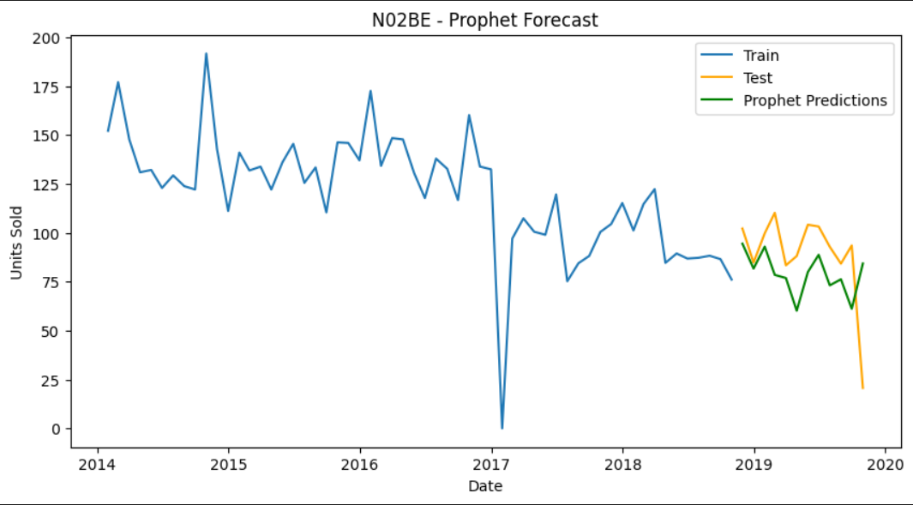
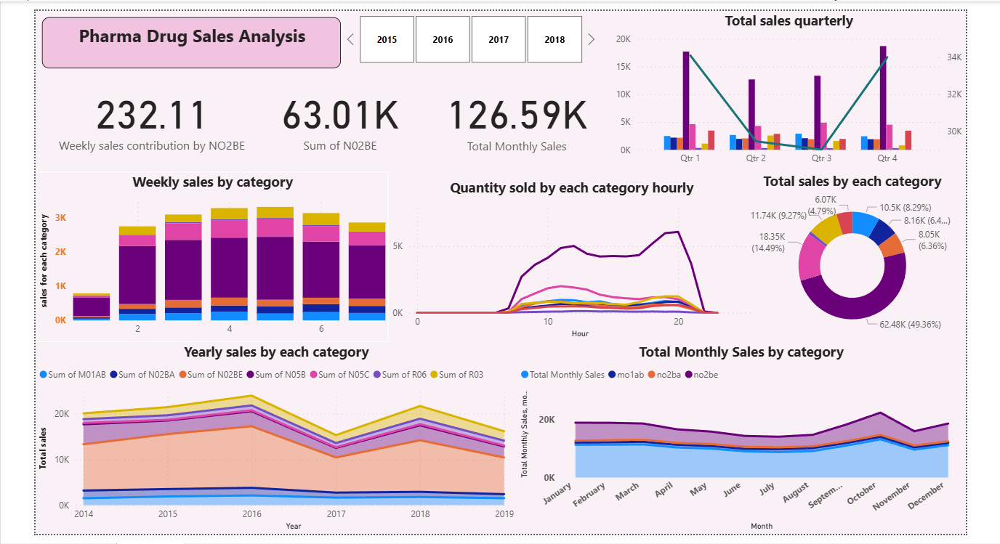
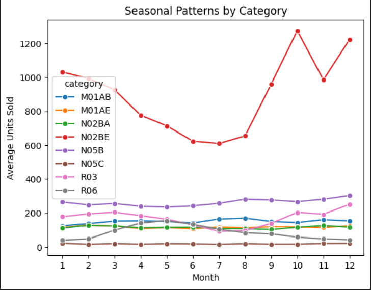

# 💊 Pharma Sales Time Series Forecasting & Analysis  

## 📌 Project Overview  
This project focuses on **time series forecasting and sales analysis** for a pharmaceutical company selling 8 types of drugs.  
The aim was to improve **procurement planning, inventory management, and sales monitoring** by forecasting demand on different time scales and creating interactive dashboards.  

- **Monthly Sales Data** → Long-term procurement planning  
- **Daily Sales Data** → Short-term operational planning  
- **Hourly Sales Data** → Real-time monitoring & visualization in Power BI  

The project combines **statistical forecasting models (SARIMAX, Prophet)** with **business intelligence (Power BI)** to generate insights.  

---

## 🗂 Dataset  
- Contains **8 drug categories** (e.g., N02BE, M01AE, N02BA)  
- Three granularities:  
  - Monthly Sales  
  - Daily Sales  
  - Hourly Sales  

---

## ⚙️ Tech Stack  
- **Python** → Data preprocessing, modeling, evaluation  
  - Libraries: Pandas, NumPy, Statsmodels, Prophet, Matplotlib, Seaborn  
- **Jupyter Notebook** → Development environment  
- **Power BI** → Interactive dashboards & visualization  

---

## 🔬 Methodology  

### 1. Data Preprocessing  
- Cleaned missing values, handled seasonality & trends  
- Identified top-selling drugs: **N02BE, M01AE, N02BA**  

### 2. Forecasting Models  
- Applied **SARIMAX** and **Prophet**  
- Training: all historical data except last 12 months  
- Testing: last 12 months for evaluation  
- Metrics: **RMSE, MSE**  

📊 **Model Performance (replace with your real results):**

| Category | SARIMAX MAE | SARIMAX RMSE | Prophet MAE | Prophet RMSE | Best Model |
| -------- | ----------- | ------------ | ----------- | ------------ | ---------- |
| N02BE    | 287.91      | 447.99       |   26.00     |   30.00      | Prophet    |
| M01AE    | 31.75       | 58.10        |   28.17     |   44.79      | Prophet    |
| N02BA    | 42.28       | 52.46        |   20.52     |   26.28      | Prophet    |

*(Prophet outperformed SARIMAX → chosen as final model)*  

### 3. Planning Horizons  
- **Monthly Forecasts** → Long-term procurement decisions  
- **Daily Forecasts** → Short-term planning  
- **Hourly Data** → Used in Power BI for **real-time insights**  

---

## 📊 Results & Insights  
- Accurate demand forecasting for **top 3 drugs (N02BE, M01AE, N02BA)**  
- Identified seasonal peaks & demand fluctuations  
- Improved **procurement accuracy** and reduced **stock-outs/overstocking**  
- Power BI dashboards visualized:  
  - Top-selling drugs  
  - Peak sales hours  
  - Seasonal demand patterns  

---

## 🖼 Visualizations  

### Prophet Forecast Example  
  

### Power BI Dashboard Example  
  

### Additional EDA Plots  
-   

---

## 🚀 How to Run  

1. Clone the repository:  
   ```bash
   git clone https://github.com/AmanSingh9918/Pharma-Sales-Time-Series-Forecasting-Analysis.git
   cd Pharma-Sales-Time-Series-Forecasting-Analysis
